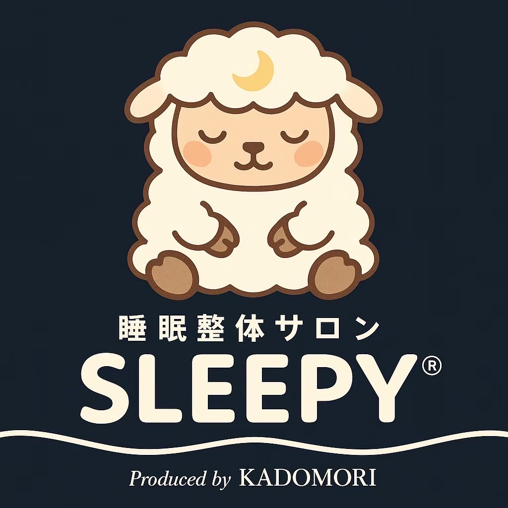

# 睡眠整体サロン SLEEPY 公式アプリ 🐑🌙

**─ 睡眠から、人生を変える。─**

株式会社SLEEPYの顧客向けWebアプリケーション。マスコット「**スーピーくん**」と一緒に、
AI診断 × 体験 × 施術 × ホームケア × アプリ × EC で睡眠を整えるプラットフォームの
顧客側体験を、**`index.html` 1枚（サーバー不要・オフライン動作）** で実装しています。



## 全体設計図「お客様の流れ 1〜14」との対応

アプリの「🏥 来店ガイド」が、設計図の14ステップをそのままガイドします。

| # | 設計図 | アプリでの実装 |
| --- | --- | --- |
| 1 | 来店前AI診断（LINEで5〜10問） | 📋 かんたんAI睡眠診断（8問・3分）→ 快眠スコア＋タイプ判定 |
| 2 | 来店・本診断（30〜50問をAI分析） | 🔬 本診断（30問・5カテゴリ）→ 整いスコア・弱点分析・AI総評 |
| 3 | 教育動画視聴 | 🎬 ミニ講座スライド3本（重要性・自律神経のしくみ・改善事例・ホームケア） |
| 4 | カウンセリング | 🗣️ 診断結果＋直近7日の睡眠サマリーを1画面に集約、悩み・目標メモ |
| 5 | 体験（施術前） | 🛏️ 寝るだけ体験＋アロマ案内、体感チェック（からだの軽さ/首肩/気分を10点満点）、姿勢分析Before |
| 6 | 施術 | 💆 呼吸ガイドアニメーション付き施術タイム |
| 7 | 効果の可視化 | ✨ 姿勢分析After＋Before/After比較、体感チェックAfter |
| 8 | AI再評価・レポート | 🤖 本日の改善レポート自動生成（姿勢差分・体感差分・AIコメント）→ カルテ保存・会員証から閲覧可 |
| 9 | 最優先ホームケア決定 | 💊 おすすめから**最大3点だけ**処方 → ホーム画面に「いまの処方」常設 |
| 10 | 商品体験・提案 | 🛍️ 分析結果ベースの商品提案（ショーケース体験の案内付き） |
| 11 | プラン・サブスク案内 | 📅 定額3プラン（ライト/スタンダード/おうちケア定期便）加入・解約 |
| 12 | EC登録・その場で購入 | 🛒 ショップ＆カート（受け取り：次回来店 or 自宅配送、在庫なし・持ち帰り不要） |
| 13 | 自宅で継続・アプリ連携 | 🌙 睡眠記録・処方ストレッチ・🎧 周波数サウンド（528Hz/シータ波/雨音をWeb Audioで生成） |
| 14 | データ蓄積・レベルUP | 🐑 XP・レベル・きせかえ解放、次回来店おすすめ日の提示（プラン連動） |

## 機能一覧

| 機能 | 内容 |
| --- | --- |
| 🐑 スーピーくん | ブランドビジュアル準拠：**金の三日月に抱かれ、三日月刺繍入りネイビーの毛布を抱いて眠る羊**をSVGで再現。呼吸・浮遊・月のゆりかごロッキング・Zzz・なでるとハート、ポインタ追従の擬似3Dチルト。気分は睡眠スコア連動、レベルアップできせかえ解放 |
| 🌙 睡眠記録 | 睡眠スコア(0-100)算出、7日間の推移・睡眠時間グラフ、履歴・編集 |
| ⚖️ 自律神経educ. | 行動チェック8項目（すべて交感/副交感への影響つき）、バランスメーター、記事8本＋クイズ |
| 📋🔬 AI診断 | かんたん診断(8問)＋本診断(30問・5カテゴリ)。結果は提案エンジン・カウンセリングに連携 |
| 🤸 ストレッチ | ガイド付きタイマー8種（自律神経へのはたらき明記） |
| 🎧 サウンド | 528Hz・シータ波（バイノーラル）・雨音を**Web Audioでその場生成**（音源ファイル不要）、タイマー付き |
| 🛍️ EC | 物販＋回数券＋サブスク3プラン。睡眠×姿勢×診断から理由付きパーソナライズ提案 |
| 🎫 会員証 | 回数券残高・有効期限・利用履歴、来店チェックイン、加入プラン、改善レポート閲覧 |
| 📸 姿勢分析 | MediaPipe Poseで正面/側面スコア化、施術前後Before/After比較（カメラ/写真/デモ） |

## 使い方

1. `index.html` をブラウザ（Chrome推奨）で開く
2. オンボーディングで「**デモデータ入りではじめる**」→ 全機能をすぐ体験できます
3. データは端末の `localStorage` のみに保存（設定からリセット可）

```bash
# ローカルサーバーで開く場合
python3 -m http.server 8000   # → http://localhost:8000
```

## スーピーくん3D（同梱済み！）

**`assets/soupy.glb` に3Dモデルを同梱しています。** three.jsでプログラム生成した
「三日月のゆりかご×ネイビー毛布」の3D版スーピーくんで、idleアニメーション
（呼吸・首かしげ・耳ゆれ・月のロッキング）入りです。

- http(s) でアプリを配信すると（Vercel / `python3 -m http.server`）、ホーム・そだてるの
  キャラが自動で `<model-viewer>` の**3D表示**になります（ドラッグで回転・自動回転）
- `file://` で直接開いた場合や読み込み失敗時は、SVG版＋擬似3Dチルトに自動フォールバック
- **差し替え方法**：より高品質なモデル（プロ制作・AI生成など）ができたら、同じファイル名で
  `assets/soupy.glb` を上書きするだけ。アプリ側の変更は不要です

**制作を発注する場合の仕様メモ**
- 形式: glTF 2.0 (.glb) / 5,000〜20,000ポリゴン / PBRテクスチャ1〜2枚(1024px)
- リグ: 頭・耳L/R・まぶた・毛布のボーン＋まばたき/口のブレンドシェイプ
- アニメーション: `idle`(呼吸+ゆれ) を既定再生。他に `happy` `sleep` `bounce` があると拡張しやすい
- 参考素材: ブランドビジュアル（三日月×毛布の羊）＋ `assets/logo.jpg`
- Blender(無償)で制作可。画像→3D生成AI（Meshy/Tripo等）で下地を作りリトポ・リグ調整する方法も低コスト

## 技術構成

- 単一HTML（React 18 UMD + Babel Standalone + Tailwind）— ランタイムは `vendor/` に同梱で**オフライン動作**
- フォント: Zen Maru Gothic / Shippori Mincho（ブランドセリフ）※CDN不達時はシステムフォント
- 骨格検出: `@mediapipe/pose`（分析時のみCDN読込。デモ分析はオフライン可）
- 3D: `@google/model-viewer`（vendor同梱・GLB設置時のみ起動）
- チャート配色はダークネイビー面(#222e4c)でコントラスト・CVD検証済み

## カスタマイズポイント

`index.html` 内のマスターデータを編集するだけで反映されます。

| 変更内容 | 場所 |
| --- | --- |
| 診断の質問・タイプ判定 | `QUICK_QS` / `ASSESS_QS` / `ASSESS_CAT_ADVICE` |
| 教育スライド・記事・クイズ | `SLIDES` / `ARTICLES` |
| ストレッチ・商品・回数券・サブスク | `STRETCHES` / `PRODUCTS` / `SUB_PLANS` |
| 提案ルール | `RECIPES` |
| 来店ガイドの文言・順序 | `VisitFlowScreen` の `STEPS` |
| レベル・きせかえ | `STAGES` / `ACCESSORIES` |
| 企業理念表示 | `MVV` |

## メモ

- 決済・LINE連携・動画配信は実運用時にバックエンドAPIへ接続してください（UIと導線は実装済み）
- 姿勢分析カメラはHTTPS/localhost（Chromeはfile://も可）で動作。使えない場合は写真/デモ入力へ
