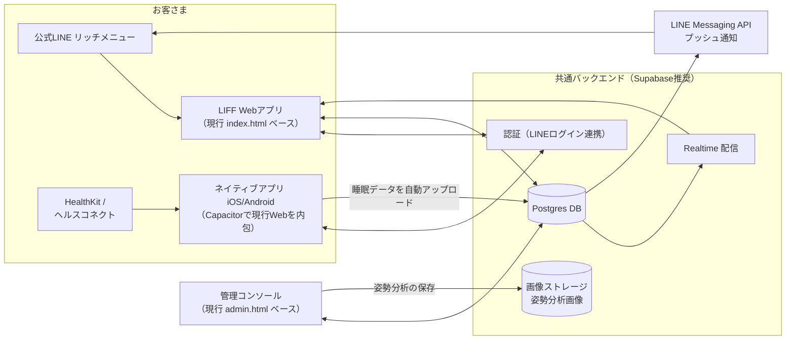

# SLEEPY アプリ 本番構成 設計書

**構成方針（決定）**: 公式LINEのリッチメニューから開く **LIFF Webアプリ** ＋ ヘルスケア自動同期用の **ネイティブアプリ（コンパニオン）** ＋ **共通バックエンド** の3点構成。
どの入口から使っても同じデータを読み書きするため、Web/ネイティブ/管理側は常に同期されます。

## 1. 全体構成図

## 2. コンポーネントと役割

| コンポーネント | 役割 | 実装ベース |
| --- | --- | --- |
| **LIFF Webアプリ** | メインの顧客体験すべて（記録・診断・姿勢レポート閲覧・EC・回数券・来店ガイド・サウンド） | 現行 `index.html`。LIFF SDKを読み込み、localStorage層をAPIアダプタに差し替え |
| **ネイティブアプリ** | ①HealthKit／ヘルスコネクトの**睡眠データ自動同期** ②プッシュ通知 ③ホーム画面ウィジェット(任意) | **Capacitor** で現行Webをそのまま内包＋ヘルスプラグイン。コードベースは1つ |
| **管理コンソール** | ダッシュボード・顧客カルテ・**姿勢分析の撮影**・売上・処方 | 現行 `admin.html`。スタッフ認証を追加 |
| **バックエンド** | 認証・DB・画像保存・リアルタイム配信・Row Level Security | **Supabase**（無料枠から。Firebaseでも可） |
| **LINE連携** | リッチメニュー→LIFF起動／Messaging APIで「週次レポート」「来店リマインド」配信 | LINE Developers（無料） |

## 3. アカウントとID（いちばん重要な設計）

- **共通IDは「LINEユーザーID」**。
  - LIFF: リッチメニューから開いた瞬間に `liff.getIDToken()` でLINE IDを取得 → **会員登録の入力ゼロ**でログイン完了
  - ネイティブ: LINEログインSDKで同じLINEアカウントにログイン → **自動的に同一ユーザーへ紐付く**
  - 管理側: スタッフ用メール/パスワード認証（Supabase Auth）＋ロール制御
- 店頭のみのお客さま（LINE未登録）は会員番号での仮アカウント → 後からLINE連携で統合
- 現行アプリの `profile.memberNo` はそのまま店頭識別子として継続利用

## 4. データモデル（テーブル）

現行アプリのstateがほぼそのままテーブルになります。

| テーブル | 主なカラム | 現行stateの対応 |
| --- | --- | --- |
| users | id, line_user_id, member_no, name, goal, staff_memo | profile / adminMemo |
| sleep_logs | user_id, date, bed, wake, quality, awakenings, feel, habits[], score, balance, **source(manual/healthkit/health_connect/csv)** | sleepLogs |
| assessments / quick_checks | user_id, date, answers, total, cats | assessments / quickChecks |
| posture_results | user_id, date, mode, phase, score, metrics, image_url, pair_id, **taken_by(staff_id)** | posture |
| visits / karte | user_id, date, menu, note, report(json) | visits(+karte) |
| tickets / ticket_uses | user_id, name, total, used, expires_at | tickets |
| orders / subscriptions | user_id, items, total, delivery / plan_id, since | orders / subscription |
| prescriptions | user_id, items[], date, until | prescription |
| xp_events | user_id, date, amount, reason | xpLog |

- **Row Level Security**: お客さまは自分の行のみ読み書き可。staff_memoなど管理専用カラムは顧客ロールから不可視
- 姿勢画像はストレージに保存しURLのみDBへ（現行のbase64保存を置換）

## 5. 主要フロー

### 5-1. 睡眠データ自動同期（ネイティブ）
1. 初回起動時にHealthKit/ヘルスコネクトの読み取り許可を取得
2. バックグラウンド（毎朝＋アプリ起動時）で睡眠サンプルを取得
3. 夜ごとに集計（就寝・起床・中途覚醒・効率→quality推定 ※現行 `summarizeSleepSessions` と同じロジックを共用）
4. `sleep_logs` へupsert（**手入力優先ルール**: source=manualの行は上書きしない）
5. LIFF側は次回表示時に最新を取得（またはRealtime購読）

→ ネイティブ未導入のお客さまは、現行実装ずみの **手入力／Appleヘルスケア書き出しファイル取込／CSV取込** をそのまま利用（機能は共存）

### 5-2. 姿勢分析の配信（管理→顧客）
1. スタッフが管理コンソールで撮影・分析（現行実装）
2. 保存時に `posture_results` へINSERT＋画像をストレージへ
3. Supabase Realtimeが顧客のLIFFへ即時プッシュ → 「姿勢レポートが届きました」
4. （任意）Messaging APIでLINEにも「本日のBefore/Afterが届きました」を送信

※現行デモの「同一端末localStorageミラー」はこのフローの仮実装。API接続時に `mirrorPostureToCustomerApp` をAPI呼び出しへ差し替えるだけ

### 5-3. LINE通知（Messaging API）
- 週次睡眠レポート／来店リマインド（要フォロー抽出と連動）／回数券期限のお知らせ
- 配信トリガはSupabase cron（pg_cron / Edge Functions）

## 6. 段階的移行ロードマップ

| Phase | 内容 | 目安 |
| --- | --- | --- |
| 0（現在） | スタンドアロンデモ（localStorage）。全UI/UX・ロジック完成 | 済 |
| 1 | Supabaseプロジェクト作成 → データ層をAPIアダプタ化 → LIFF登録してリッチメニューから公開 | 1〜2週間 |
| 2 | Capacitorでネイティブ化 → HealthKit/ヘルスコネクト同期 → ストア申請 | 2〜4週間（審査含む） |
| 3 | Messaging API通知・決済（Stripe/LINE Pay）・予約連携 | 順次 |

現行コードは `loadState/saveState/update` にデータアクセスが集約されているため、Phase1は**この3関数をAPI版に差し替えるのが中心作業**です。

## 7. 必要アカウントと概算費用

| 項目 | 費用 |
| --- | --- |
| LINE Developers（LIFF・Messaging API） | 無料（配信通数従量: 月200通まで無料〜） |
| Supabase | 無料枠 → Pro $25/月（顧客数百人規模なら無料枠で十分開始可） |
| Vercel（Web/管理ホスティング） | 現行のまま（無料枠〜） |
| Apple Developer | $99/年 |
| Google Play | $25（買切り） |
| 合計（初年度目安） | **約2〜5万円＋通知従量** |

## 8. セキュリティ・個人情報の注意

- 睡眠・健康データは要配慮個人情報に準ずる扱いに: 取得目的の明示と同意画面（初回オンボーディング）、退会時の削除導線
- HealthKitデータは**睡眠改善目的以外に使用しない**旨をプライバシーポリシーに明記（App Store審査要件）
- スタッフメモは顧客非公開カラムとしてRLSで隔離／管理コンソールはスタッフ認証＋PINの二段構え
- 通信はすべてHTTPS、画像ストレージは署名付きURL
